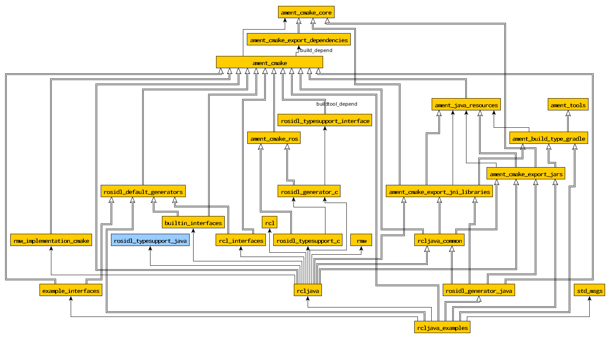

# ada4ros2
Main repository of the RCLAda project. Currently available for Ubuntu 18.04 LTS and ROS2 Dashing/Foxy.

This repository is actually a ROS2 workspace. It can be checked out directly and compiled as a regular ROS2 overlay. Package repositories are brought in as submodules and are individually available at https://github.com/ada-ros/

## Instructions
This project relies on the system's default Ada compiler, which is GNAT FSF 7 in Ubuntu 18.04. Installing the `gnat` and `gprbuild` packages should be enough in Ubuntu/Debian.

1. Follow the official instructions to install ROS2 (either [binary](https://github.com/ros2/ros2/wiki/Linux-Install-Debians) or [from source](https://github.com/ros2/ros2/wiki/Linux-Development-Setup) should work).
   1. If installing from sources, you can use the contents of [ros2deps.txt](ros2deps.txt) to build only the necessary dependencies: `colcon build --packages-up-to $(cat ros2deps.txt)`. This will cut your build time in half.
1. Clone the [ada4ros2](https://github.com/ada-ros/ada4ros2) repository with submodules: `$ git clone --recurse-submodules`.
1. Enter the repository root folder and issue `$ colcon build`
   1. You may need to install package `python3-colcon-common-extensions` to make `colcon` available.
1. Source the `./install/setup.bash` script.
1. Try to run some example nodes: `$ ros2 run rclada_examples listener`. Tab completion should work too.

Alternatively, you can import with `vcs` the [ada4ros2.repos](https://raw.githubusercontent.com/ada-ros/ada4ros2/master/ada4ros2.repos) file in this repository to prepare the Ada workspace overlay.

1. Download the [ada4ros2.repos](https://raw.githubusercontent.com/ada-ros/ada4ros2/master/ada4ros2.repos) file to the folder you're using as workspace.
1. Run `vcs import src < ada4ros2.repos`
1. Continue as in the above list from `colcon build`.

## Testing your installation

Assuming, you have successfully built the ada4ros2 overlay and sourced it, you can run its examples and self-test node to ensure it works as expected:

- `ros2 run rclada <test>`, with `<test>` one of:
    - `rclada_selftest`: tests all message/service-related features.
    - `rclada_test_multicore <n>`: tests the pooled executor, with _n_ threads.
    - `rclada_test_allocators <n>`: tests the pooled executor, with _n_ threads, using a custom allocator that reports memory use leaks/statistics.

- `ros2 run rclada_examples <executable>`, which executable one of:
    - `talker, listener, add_two_ints_server, add_two_ints_client[_async]`: examples compatible with the ones in the demo_nodes_cpp/demo_nodes_py packages.
    - `listener_metadata`: as listener, but additionally dumps thorough metadata information about received messages
    - `graph_info`: shows topological information about the topics/subscriptions/services.
    - `pong_class, pong_generic`: nodes that send messages to each other illustrating the two ways of node extension in Ada, either using generics or using classwide inheritance.

## Creating Ada nodes

Nodes can be entirely written in Ada, without the need for C/C++ files or main program.
Please check the examples in the [rclada_examples](https://github.com/ada-ros/rclada_examples) repository for some ideas.

Ada code is compiled using gprbuild. Once you have succesfully run `colcon build`, you can use the aggregate project file `ada4ros2.gpr`, in the root folder, as a starting point for development. This file includes all RCLAda libraries and a sample user project. The file is designed to be open with the GPS editor from GNAT, and to develop Ada code without going through the `colcon build` process every time. Compilation can be launched directly from GPS and should succeed.

While developing in GPS is a convenience, the final package build is to be done through `colcon`, as with any other ROS2 package. This project provides some CMake functions to greatly simplify the inclusion of a GPR project in the ROS2 build process:

- Your ROS2 package should use the **ament_cmake** build method of `colcon`.
- You must not call the `ament_package()` macro, rclada does it for you.
- See the next section and the package `rclada_examples` to see the available CMake functions.

### CMake functions

To simplify the integration of GPR-based Ada projects, the `rclada_common` package provides the following CMake functions (all of them starting with `ada_*`. The two first ones are the most important, and the rest could be useful for special Ada projects (like bindings):

- `ada_begin_package()` must be called first, right after `find_package(rclada_common)` to initialize the package Ada environment.

- `ada_end_package()` must be called last to ensure Ada environment settings are propagated. This also calls `ament_package()` for you.

- `ada_add_executables(TARGET SRCDIR DSTDIR EXECUTABLES)` declares the Ada targets built by the package:
    - TARGET is a name on which other targets may depend.
    - SRCDIR is a relative path in the package containing an Ada/GPR project.
    - OUTDIR is the relative path from the .gpr project file in which the final executables are built.
    - EXECUTABLES is the remainder of arguments, which are the executables built by the Ada project.

- `ada_add_library(TARGET SRCDIR GPRFILE)` declares an Ada library that is made available to other packages:
    - TARGET (same as above)
    - SRCDIR (same as above)
    - GPRFILE: GPR library project which will be built and installed in the Ada environment.

- `ada_import_interfaces(PKG_NAME[, PKG_NAME...])`
    - Causes the generation of the Ada specification files corresponding to messages and services in PKG_NAME (and all recursive dependencies). These files are made available through a GPR project of name `ros2_PKG_interfaces.gpr` (where PKG is the one invoking `ada_import_interfaces`).

- `ada_import_c_headers(LIBNAME INCLUDE_DIR)` is a helper to make C headers available if they are not part of a library.
    - LIBNAME is a name that will be used as `clib_LIBNAME.gpr`
    - INCLUDE_DIR is the path to make available (like in a `-I` flag)

- `ada_import_c_libraries(ARGN)`  is a helper to use C libraries built by other packages.
    - ARGN is a list of library files (*.so, *.a) that will be made available to the Ada environment as `clib_*` GPR project files. (E.g., for `libgsl.a` you obtain `clib_gsl.gpr`.)

- `ada_generate_binding(TARGET SRCDIR GPRFILE INCLUDE)` generates a supporting low-level Ada binding for the given C header files, with `g++ -fdump-ada-spec`, that is integrated in a high-level Ada project. The project must provide a `gen` folder in which autogenerated sources will be placed before compilation. Check the [rclada's RCL project](https://github.com/ada-ros/rclada/tree/master/gpr_rcl) for an example.
    - TARGET (as above)
    - SRCDIR (as above), contains the high-level Ada project.
    - GPRFILE (as above)
    - INCLUDE: semicolon-separated list of C headers whose Ada specs will be autogenerated.

## Using the rclada ROS2 Client Library binding.

The library is provided by the `rclada` ROS2 package. However, your package must depend on all of:
- `rclada_common`, which provides the CMake functions.
- `rosidl_generator_ada`, which provides the interfaces to ROS2 messages.
- `rclada`, which provides the Ada binding.

Check the [rclada_examples](https://github.com/ada-ros/rclada_examples) package for a starting point for your package, since it is written purely as a regular client.

The GPR projects that you can use in your nodes, that you have to `with` on your own project files, are:

- `rcl.gpr`, which makes available the Ada RCL equivalent client library.
- `rosidl.gpr`, which provides dynamic support for messages and typesupports.
- `ros2_*_interfaces.gpr`, which are necessary to use messages/services from other packages.

There are two hierarchies of Ada packages in the Ada RCL binding:

1. `RCL.*` packages form the high-level, manually curated binding.
1. `RCLx.*` is the automatically generated binding (with `g++ -fdump-ada-spec`). It is not intended for direct use but it should be complete if something is still missing in the high-level binding. It also ensures that changes in the C RCL are detected and properly integrated in the Ada high-level binding.

Additionally, there is both a high-level and low-level binding to `rosidl` packages:

1. `ROSIDL.*` packages are used by `RCL.*`, and by users to deal with messages/services.
    1. `ROSIDL.Static.<importing pkg>.<imported pkg>.Messages|Services.<interface name>` contain the Ada types corresponding to messages used by topics and services.
    1. `ROSIDL.Dynamic` contains Ada types to use messages through runtime introspection (older deprecated method).
1. The low level bindings to `rosidl_generator_c`, `rosidl_typesupport_c`, and `rosidl_typesupport_introspection_c`
are too autogenerated, and should not be needed unless you use something from `RCLx.*`, which should be a last resort (there is no foreseeable need at present).

All examples provided use exclusively the `RCL.*` and `ROSIDL.*` hierarchies.

### Implementation status

#### RCL client library:

These statuses refer to the high-level binding; the low-level one is always generated.

- Main features:
    - `RCL.Nodes`: Complete 
    - `RCL.Publishers`: Complete 
    - `RCL.Subscriptions`: Complete 
    - `RCL.Clients`: Complete 
    - `RCL.Services`: Complete 
    - `RCL.Actions`: Partial  (thin binding only ATM)
- Support:
    - `RCL.Allocators`: Complete 
    - `RCL.Calendar`: Complete 
    - `RCL.Executors`: Complete 
    - `RCL.Graph`: Complete 
    - `RCL.Options`: Partial  (always default QoS at present)
    - `RCL.Timers`: Complete 
    - `RCL.Wait`: Complete 

#### ROSIDL message support for Ada

- Dynamic access (through introspection):
    - Typesupport: Complete 
    - Simple types: Complete 
    - Nested types: Complete 
    - Array types: Complete 
    - Matrix types: Complete 
- Static access (through generated types):
    - Typesupport: Complete 
    - Simple types: Complete 
    - Nested types: Complete 
    - Array types: Complete 
    - Matrix types: Deprecated by ROS2 in favor of semantically-appropriate custom messages, although available through their statically generated types.

#### ColCon integration

- `ament_cmake` build type: Complete 
  - Stand-alone executables: Complete 
  - Export Ada libraries to Ada clients: Complete 
  - Export Ada libraries to C-compatible clients: Manual 

<!--

-->

## Extras

Some developer notes I have taken:
- Fixed size arrays are generated in place in the message struct (metadata size=fixed size)
- Variable size arrays are generated as a member message with pointer and size (metadata size=0)

Since rclada initially attempted to follow the ros2_java project structure, I did these dependency graphs on the java_examples package.
This one is simplified removing some common and indirect dependencies, you can see the full one [here](doc/java_example_depends.png).
These might help in understanding some of the interrelations amongst ROS2 packages.

### Acknowledgements

This project is done with the support of the following entities:

* AdaCore, provider of the open source Ada 2012 compiler https://www.adacore.com/community
* The Robotics, Perception and Real-Time group, RoPeRT, http://robots.unizar.es
* The Defense University Center of Zaragoza, CUD-Z, http://cud.unizar.es
* The ROSIN project, whose funding has enabled the porting from Bouncy to Dashing and Foxy, and continued development to reach feature parity during early 2021. https://rosin-project.eu/results

